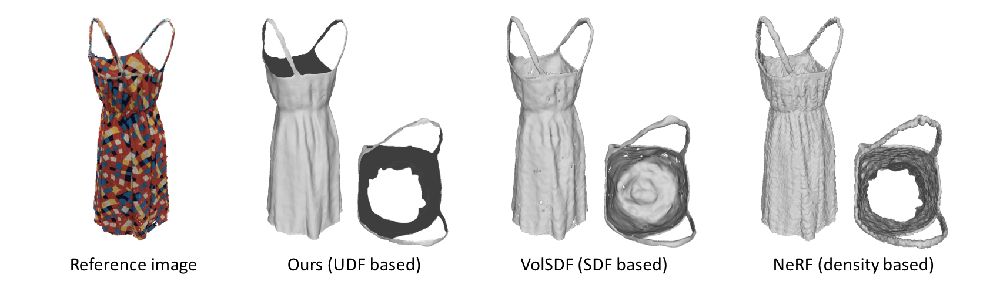

# Learning Unsigned Distance Fields for Multi-view Reconstruction of Surfaces with Arbitrary Topologies

## [Project Page](https://www.xxlong.site/NeuralUDF/) | [Paper](https://arxiv.org/pdf/.pdf) 

## Introduction
We present a novel method, called NeuralUDF, for reconstructing surfaces with arbitrary topologies from 2D images via volume rendering.
However, these methods are limited to objects with closed surfaces since they adopt Signed Distance Function (SDF)
as surface representation which requires the target shape to be divided into inside and outside.
In this paper, we propose to represent surfaces as the Unsigned Distance Function (UDF) and
develop a new volume rendering scheme to learn the neural UDF representation.
Specifically, a new density function that correlates the property of UDF with the volume rendering scheme is introduced for robust optimization of the UDF fields.
Experiments on the DTU and DeepFashion3D datasets show that our method not only enables high-quality reconstruction of non-closed shapes with complex typologies, but also achieves comparable performance to the SDF based methods on the reconstruction of closed surfaces.
            
